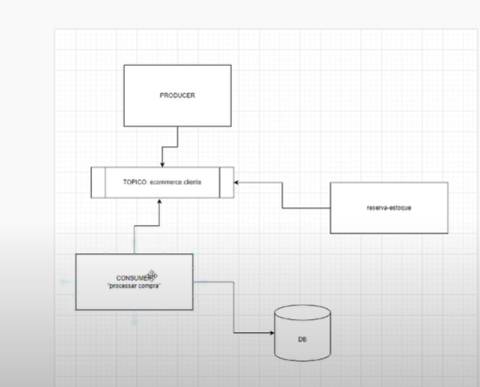

## APACHE KAFKA
Ele não é message broken e sim,
Sistema de stream de dados:


- Quando temos uma evento de sistema para
outro e no fim isso é descartado
estamos falando de **Mensagens**
Ex: Event Notification

Event-Carried State Transfer
Envio da coisa que mudou. como um (todo)
Ex: Dados Inteiros = (Sistema de Stream de dados)

Apache Kafka = e um banco de dados mais 
simples que guarda LOG = Com periodo de retenção: 60 Dias, 1 ano, Infinito

Imutável
1 2 3 4

Dados em forma em fila
1 registro após o outro 1

TOPICO = Pub and Sub

Producer --> Tópico <-- Consumidor A
                |-------Consumidor B
                |-------Consumidor C
                |-Ler do inicio--Fastão


## How to use:

#### Config and Start kafka on Windows
1. Install kafka

ATENTION: ALWAYS INSTALLL (Kafka) in the (C:/).

2. You can see to principal files
3. Open configs
You can see the configs properties

```
producer.properties
zookeeper.properties
```
C:\kafka_2.13-3.7.0\bin\windows
4. Open /bin/windows
5. Run cmd zookeeper 

zookeeper-server-start.bat ../../config/zookeeper.properties

6.After run kafka

kafka-server-start.bat ../../config/server.properties

In the same dir `/bin/windows`

7.Show all topics run cmd

kafka-topics.bat --bootstrap-server localhost:9092 --describe

8.Create one topic

kafka-topics.bat --bootstrap-server localhost:9092 --topic compras.db.cliente --create --partitions 1

9.Show all topics run cmd

	kafka-topics.bat --bootstrap-server localhost:9092 --describe

10. Update partitions
	kafka-topics.bat --bootstrap-server localhost:9092 --alter --topic ecommerce.compras --partitions 3

11. Delete topic
kafka-topics.bat --bootstrap-server localhost:9092 --delete --topic ecommerce.compras --partitions 3

#### Implementation in java

1. Install dependencies in pow

Kafka-Clients: Client Java para comunicação com Kafka
SLF4J Simple binding: Sistema de logs para rodar a aplicação


````xml
    <dependency>
    <groupId>org.apache.kafka</groupId>
    <artifactId>kafka-clients</artifactId>
    <version>2.4.1</version>
    </dependency>
    <dependency>
        <groupId>org.slf4j</groupId>
        <artifactId>slf4j-simple</artifactId>
        <version>1.7.30</version>
        <scope>test</scope>
    </dependency>
````

2. Create one producer

var producer = new KafkaProducer<String, String>(properties());


create one method 
```java
public class Producer {
	public static void main(String[] args) throws ExecutionException, InterruptedException {

		var producer = new KafkaProducer<String, String>(properties());

		var record = new ProducerRecord<String, String>("compras.do.cliente", "cliente-1", "compras:50reais");

		Callback callback = (data, ex) -> {

			if (ex != null) {
				ex.printStackTrace();
				return;
			}
			System.out.println("Enviado com sucesso");
			System.out.println(data.partition());
			System.out.println(data.offset());
		};

		producer.send(record, callback).get();

	}

	private static Properties properties() {
		Properties properties = new Properties();
		// Where kafka is running
		properties.setProperty(ProducerConfig.BOOTSTRAP_SERVERS_CONFIG, "127.0.0.1:9092");
		// to Serialize the key
		properties.setProperty(ProducerConfig.KEY_SERIALIZER_CLASS_CONFIG, StringSerializer.class.getName());
		// to Serialize the value
		properties.setProperty(ProducerConfig.VALUE_SERIALIZER_CLASS_CONFIG, StringSerializer.class.getName());
		return properties;
	}
}
```
and consumer

```java
public class Consumer {
	public static void main(String[] args) {
		var consumer = new KafkaConsumer<String, String>(properties());
		// consumir as mesagens

		consumer.subscribe(Collections.singletonList("compras.do.cliente"));

		while (true) {
			// What time in time to consumer
			var records = consumer.poll(Duration.ofMillis(100));
			for (var record : records) {
				System.out.println("Compra nova:");
				System.out.println(record.key());
				System.out.println(record.value());
				System.out.println(record.partition());
				System.out.println(record.offset());
			}
		}
	}

	private static Properties properties() {
		Properties properties = new Properties();
		// Where kafka is running
		properties.setProperty(ConsumerConfig.BOOTSTRAP_SERVERS_CONFIG, "127.0.0.1:9092");
		// to Serialize the key
		properties.setProperty(ConsumerConfig.KEY_DESERIALIZER_CLASS_CONFIG, StringDeserializer.class.getName());
		// to Serialize the value
		properties.setProperty(ConsumerConfig.VALUE_DESERIALIZER_CLASS_CONFIG, StringDeserializer.class.getName());
		properties.setProperty(ConsumerConfig.GROUP_ID_CONFIG, "consumo-cliente");
		return properties;
	}
}
```

### Multiplas Partições /Multiplos Consumidores - Paralelismo

* kafka com múltiplas partições, ou seja, podemos introduzir mais de um consumidor para o mesmo tópico para diminuir o tempo de processamento total.
* processo de paralelismo
* resilience In case of one partitions break the code go on running

1. Start kafka and run

    kafka-topics.bat --bootstrap-server localhost:9092 --topic
    ecommerce.compras --create partitions 3




### Multiplos Consumidores - GroupId
Problem:

When one consumer use the message, it's deleted after used

Solution: 

Create grupoId for consumers

