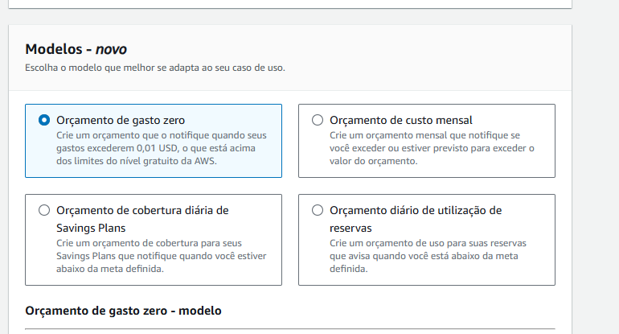

Autenticacao

1. Entre no painel principal
2. Clique no usuario
3. Credenciais de segurança
4. Autenticação multifator (MFA)
5. Selecione (Aplicação autenticadora)
6. Abra o qrcode
7. Digite os dois codigo que aparece no app celular google autenticate

### Gerenciamento de faturamento e custos

Para estabelece um limite de gastos e ser notificado se
atingir

1. Va em Gerenciamento de faturamento e custos
2. Orcamentos
3. Cria Orçamentos ou Bugdets
4. Haverá seleções

4. Coloque o seu email para notificação
5. Crie o orcamento

### Fatura
Para visualizar os seus gastos
1. Podendo imprimir ou fazer o download

### Como calcular os custo da aws antecipadamento

Pesquise no google AWS pricing Calculator