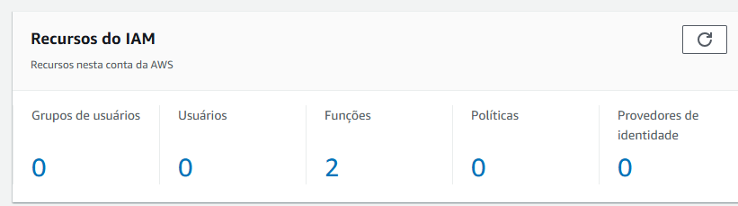
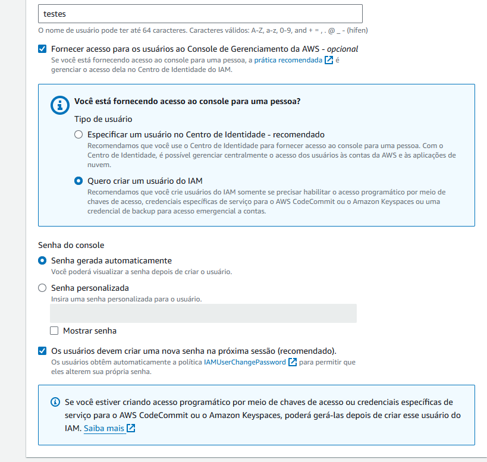
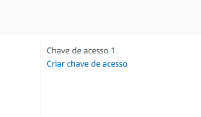

## Usuários, Roles e Permissões de Acesso AWS IAM - Curso Prático Amazon Web Services

https://youtu.be/spUlvo0HNFQ?list=PLOF5f9_x-OYUaqJar6EKRAonJNSHDFZUm

1. Digite no barra de pesquisa IAM

2.Na parte de (recurso da IAM) haverá 

3. Crie um novo usuario > Vá em usuarios 

2. Selecionar as permissoes
tester:
senha:

3. Criar grupos

4. para acesso a api

1. Crie usuario
2. Selecione senha
3. Adicione ou grupo ou permissoes
4. Apos criado copie os dados em email
5. Acesse URL dentro do email para usar applicacao

