A **Amazon Virtual Private Cloud (Amazon VPC)** permite que você crie uma rede virtual isolada na nuvem. Essa rede é semelhante a uma rede tradicional que você operaria em seu próprio datacenter, mas com os benefícios da infraestrutura escalável da AWS¹. Com a VPC, você tem controle total sobre o ambiente de rede virtual, incluindo posicionamento de recursos, conectividade e segurança³. Basicamente, é uma maneira de definir sua própria rede privada na nuvem da Amazon, onde você pode implantar recursos como instâncias do **Amazon EC2** e **Amazon RDS**². 😊

* Subnets : Subrede da vpc 

#### 1. Crie um vpc = PAi de todas as redes
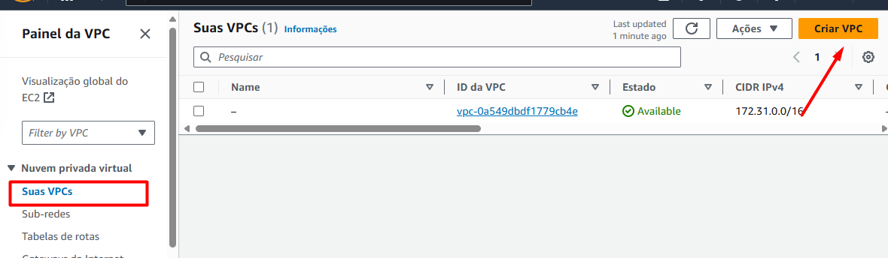
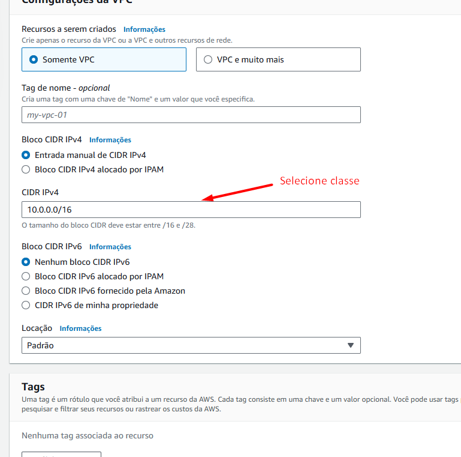

#### 2. Criar subnet ou subrede: São as zonas com faixa ips que cada um ira utilizar
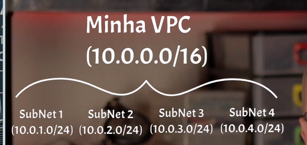
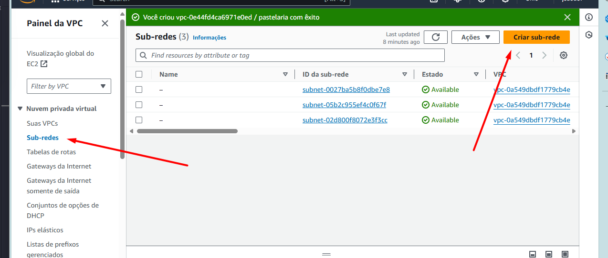

#### 3. Ao criar 2 ou mais subnets em varios datacenter diferente
- Distribui suas maquinas em datacenter diferentes.
- Não tendo problema se um datacenter desse inteiro caia ou fica fora do ar.

#### 4. Da acesso a VPC a internet. Pois ela estar interna ainda;
Abra internet Gateway

1. Abra o internet Gateway
2. Coloque o nome para ela
3. Anexe sua nova vpc a ela

#### 5. Maquina precisam se encontrar tirando os ips dinamicos

    1. Volte na suas vpcs
    2. Vá em configurações Editar configurações da VPC!
    [alt text](image-5.png)

    3. Habilite resolução de DNS e nomes de host DNS
    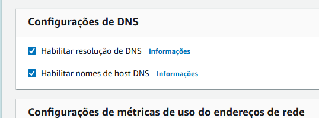
    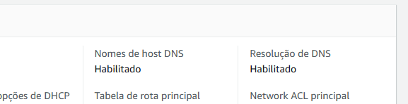

#### 6. Regra de segurança da VPC

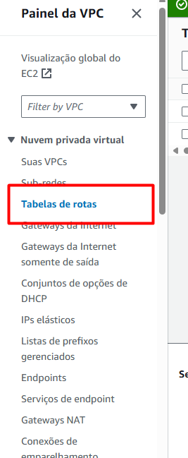

1. Coloque toda requisição entrar ira para rede local
Sem redirecionamento nenhuma da maquinas consiguirá     acesso externo
2. Edite rota local e adicione mais uma rota

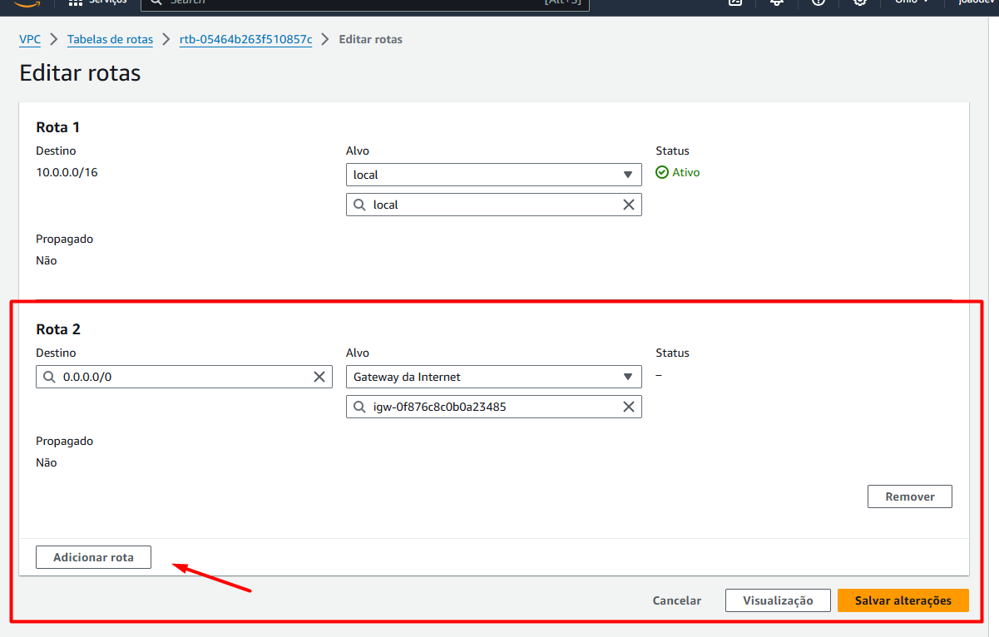

#### 7. Grupos de Seguranças

* Configuração permite saber que maquina 
tem acesso a que maquina
* quais maquinas ficaram acessiveis para 
usuario externos

* Google,nem bing indexe elas 

1. Acesse grupo de segurança
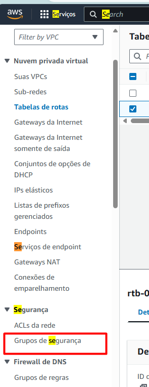
2. Crie uma novo grupo
3. Selecione a vpc

Libere somente as portas necessárias

Inbound = Se alguém estive tentando acessar ele
Outbound = Ele tentando acessar algo para fora

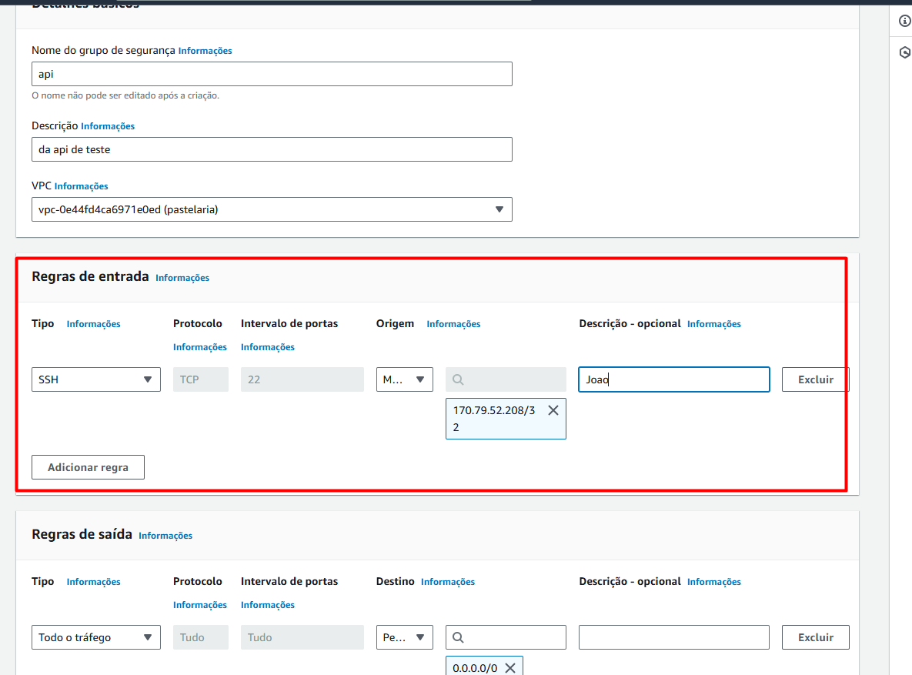

2. Adicionando HTTPS

3. Permitindo somente a grupo de segurança do banco possa aceita somente a conexão da API

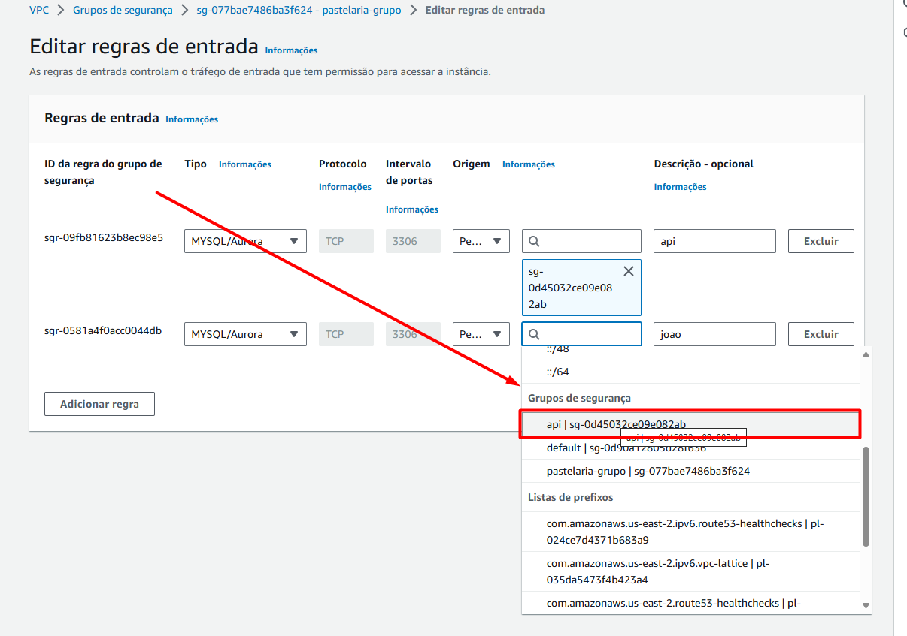