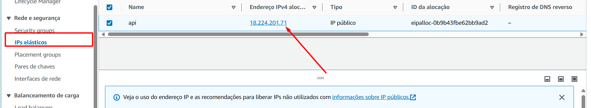

# EC2
Instancia

#### 1 Create one instance

1. to go on instances
2. click in executar instance
3. Select one instance

4. After finished creation of instance
5. Create one picture of instance or copy of image

6.Difference between and Snapshot and Image: Snapshot copy of HD of instance and image get all from HD become he bootable

7. You can see images and AMIs

8. Now you can create new instance from the Image created times ago if you want.

9. You create one volume too. It's in the **Elastic Block Store > volumes**

10. I must to finish instance because, you'll pay for provisomanento de disco without use.

11. Add one elastic IP, for public connection for you machine

***Attention*** the elastic IP most be in use for you don't pay for it.

12. Add a IP elástico to interface 

***Attenction*** In case of removal of instance you can assign this IP to
new instance, you can use same IP public for another instances.